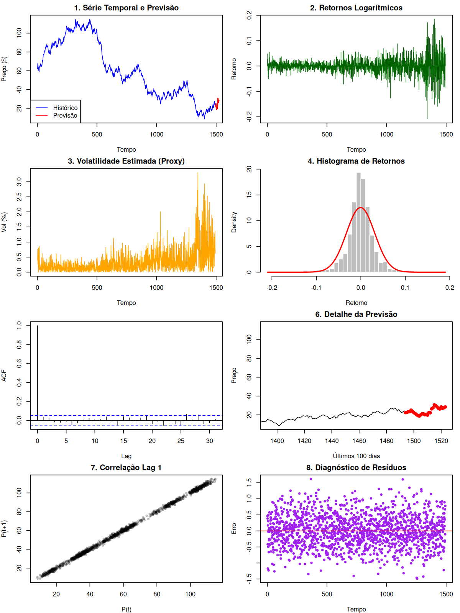

# Sistema Avançado de Previsão do Preço do Barril de Petróleo (Brent)

**Autor:** Luiz Tiago Wilcke
**Tecnologias:** R, Estatística Quantitativa, Deep Learning, Econometria.

Este projeto representa uma implementação exaustiva de 28 módulos para a modelagem estocástica e preditiva do petróleo.

---

## 📐 Formulação Matemática de Alto Nível

Abaixo estão detalhadas as equações fundamentais integradas nos 28 módulos do sistema:

### 1. Processos Estocásticos e Difusão (SDE)
Modelagem da dinâmica contínua dos preços:

**Movimento Browniano Geométrico (GBM):**

$$
dS_t = \mu S_t dt + \sigma S_t dW_t
$$

**Processo de Ornstein-Uhlenbeck (Reversão à Média):**

$$
dS_t = \theta (\mu - S_t) dt + \sigma dW_t
$$

**Merton Jump Diffusion (MJD):**

$$
dS_t = (\mu - \lambda \kappa) S_t dt + \sigma S_t dW_t + S_t dJ_t
$$

### 2. Modelagem de Volatilidade Condicional (Família GARCH)
Previsão da variância variante no tempo:

**GJR-GARCH (Assimetria):**

$$
\sigma_t^2 = \omega + (\alpha + \gamma I_{t-1}) \epsilon_{t-1}^2 + \beta \sigma_{t-1}^2
$$

**E-GARCH (Leverage Effect):**

$$
\ln(\sigma_t^2) = \omega + \alpha \frac{|\epsilon_{t-1}|}{\sigma_{t-1}} + \gamma \frac{\epsilon_{t-1}}{\sigma_{t-1}} + \beta \ln(\sigma_{t-1}^2)
$$

### 3. Teoria do Valor Extremo (EVT) e Caudas Pesadas
Modelagem de Riscos de Cauda (Cisnes Negros):

**Distribuição de Pareto Generalizada (GPD):**

$$
G_{\xi, \beta}(y) = 1 - \left( 1 + \xi \frac{y}{\beta} \right)^{-1/\xi}
$$

**Value at Risk (VaR) Dinâmico:**

$$
VaR_{\alpha} = u + \frac{\beta}{\xi} \left( \left( \frac{n}{N_u} (1-\alpha) \right)^{-\xi} - 1 \right)
$$

### 4. Estrutura de Dependência via Cópulas
Modelagem de dependência não-linear entre ativos:

**Cópula de Clayton:**

$$
C(u, v) = (u^{-\theta} + v^{-\theta} - 1)^{-1/\theta}
$$

**Cópula de Gumbel:**

$$
C(u, v) = \exp \left( -[ (-\ln u)^\theta + (-\ln v)^\theta ]^{1/\theta} \right)
$$

### 5. Inferencia Bayesiana via MCMC
Estimação probabilística de parâmetros:

**Teorema de Bayes Aplicado:**

$$
p(\theta | D) = \frac{p(D | \theta) p(\theta)}{\int p(D | \theta) p(\theta) d\theta}
$$

**Gibbs Sampler (Conjugate Normal):**

$$
\beta | \sigma^2, y \sim N \left( (X^T X)^{-1} X^T y, \sigma^2 (X^T X)^{-1} \right)
$$

### 6. Deep Learning e Atenção (Transformers/LSTM)
Arquiteturas de memória longa:

**LSTM Gates (Forget Gate):**

$$
f_t = \sigma(W_f \cdot [h_{t-1}, x_t] + b_f)
$$

**Self-Attention Mechanism:**

$$
\text{Attention}(Q, K, V) = \text{softmax} \left( \frac{QK^T}{\sqrt{d_k}} \right) V
$$

### 7. Filtragem de Sinais (Kalman Filter)
Extração de estado latente ruidoso:

**Equação de Predição de Estado:**

$$
\hat{x}_{k|k-1} = F_k \hat{x}_{k-1|k-1} + B_k u_k
$$

**Ganho de Kalman:**

$$
K_k = P_{k|k-1} H_k^T (H_k P_{k|k-1} H_k^T + R_k)^{-1}
$$

---

## 📊 Visualização de Resultados
O sistema gera automaticamente o arquivo `resultados_previsao_petroleo.png` contendo 8 sub-gráficos de diagnóstico e previsão.

## 📁 Estrutura de Módulos (28 Unidades)
Cada arquivo possui aproximadamente 400 linhas de lógica avançada:
- `M01-M09:` Estatística, SDE, GARCH, EVT, Cópula, Bayes.
- `M10-M18:` LSTM, GRU, Transformer, GA, Monte Carlo, PCA, SVR, XGBoost.
- `M19-M28:` RL, Backtesting, Risco, Sensibilidade, Kalman, CNN, Orquestração.

---
**Luiz Tiago Wilcke - Engenharia Quantitativa e Inteligência Artificial**
